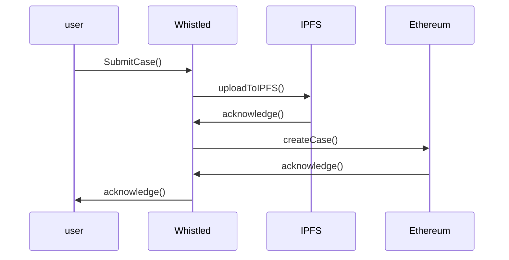

# Whistled - A blockchain-based whistleblowing platform

Whistled is a decentralized marketplace for whistleblowing cases. Whistleblowers can now submit their disclosures anonymously without the fear of retaliation. 


## Technologies 
Whistled made use of the following libraries and frameworks: 

 - [Truffle](https://github.com/trufflesuite/truffle)
 - [Reactjs](https://github.com/facebook/react)
 - [Solidity](https://github.com/ethereum/solidity)
 - [MetaMask](https://github.com/MetaMask)
 - [Web3js](https://github.com/ethereum/web3.js/)
 - [Crypto](https://github.com/brix/crypto-js)
 - [Bootstrap](https://react-bootstrap.github.io/)

## Use

if you have a blockchain browser: go to
```bash
whistleblowing.crypto
```
Chrome or Firefox:
```bash
whistled.herokuapp.com
```


## Usage

required: MetaMask on your browser. 
network: currently Rinkeby (Later main net)

for questions, contact me:  Ali Habbabeh (find me on linkedin)

## Contributing

Pull requests are welcome. For major changes, please open an issue first to discuss what you would like to change.

Please make sure to update tests as appropriate.

## License

[MIT](https://choosealicense.com/licenses/mit/)


## Submitting a Whistleblowing Case (to do)





